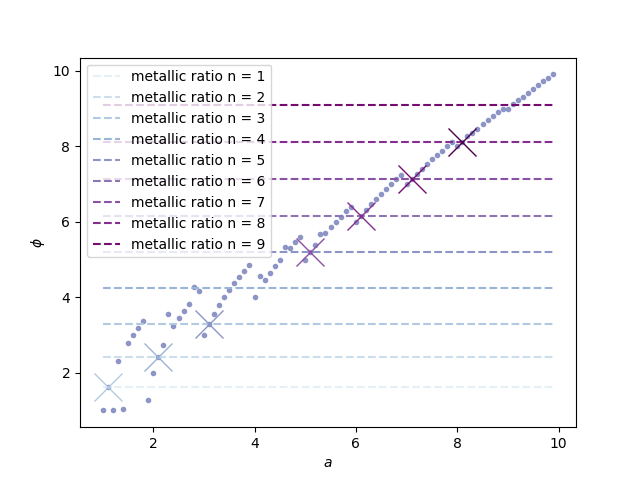

# Code to generate dungeon numbers 
Inspired by [this numberphile video](https://www.youtube.com/watch?v=HFeKdMf01rQ)  I thought I would throw something together to check out how these numbers behave.
Uses Python 3.8. Requirements are specfied in requirements.txt

Output:

Lines indicate the [metallic means](https://en.wikipedia.org/wiki/Metallic_mean). 
For some reason 4.1 and 9.1 do not work. Will investigate later. Only works for the Reals.
